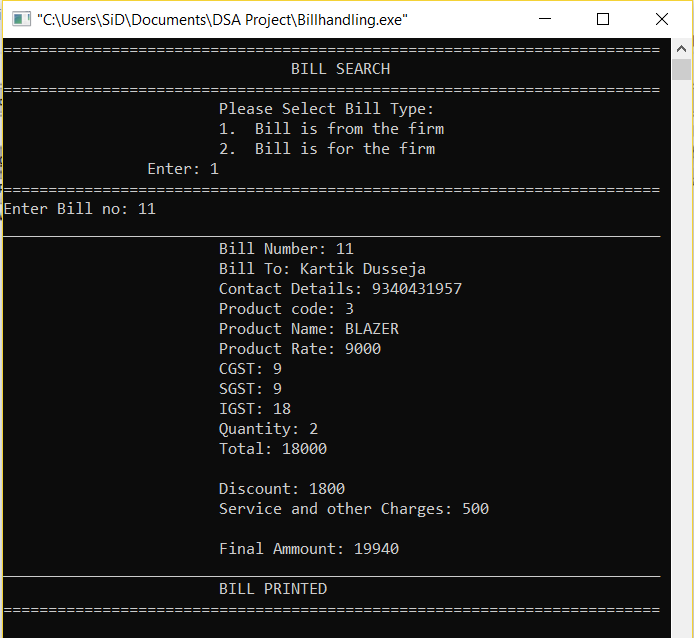

# stock_management_CPP

A C++ project created for DSA project submission(Semester 2 B.Tech.). The program is full command line based and take the input in same. Provided with many functionalities to maintain various data for managing of products at shop as well as factory. We can feed bills, products, invoices. Moreover we can search bills/invoices and display them, similarly find the products and view them as well. Other than handling these data, program also stores profiles of Owner, Manage and Employees, having different access at different user level.

## Modules 
The main menu/programs icludes:
* Profile Login(Owner/Manager/Employee)
* Create/Edit Profile
* Bill Entry
* Bill Search
* Show All Existing Bills
* Product Entry
* Find Product
* All Products
* Create Invoice
* Search Invoice
* All Invoices

## Mindmap
We can Understand the concept and working of project by laying out all modules and having a graphical type of representation such as below:

> More Functionalities can easily be added in this program due to the nature of project. This Project was for sole purpose of learning C++ and its implementation, hence it is far from a finished software/program to be used anywhere, though it can be modified and used for learning purposes.

## Screenshots of Program
* **Profile Handling**

Create Profile | View Profile
--- | ---
 | 
---

* **Bill Entry**

Bill Menu | Bill from Firm | Bill for Firm
--- | --- | ---
 |  | 
---

* **Bill Search**

Bill Search Menu | Bill Search Output
--- | ---
 | 
---

* **All Bills**

---

* **Product Entry**

---

* **Find Product**

---

* **All Products**

---

* **Create Invoice**

---

* **Search Invoice**

---

* **All Invoice**

